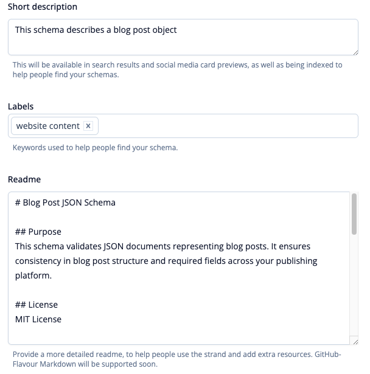
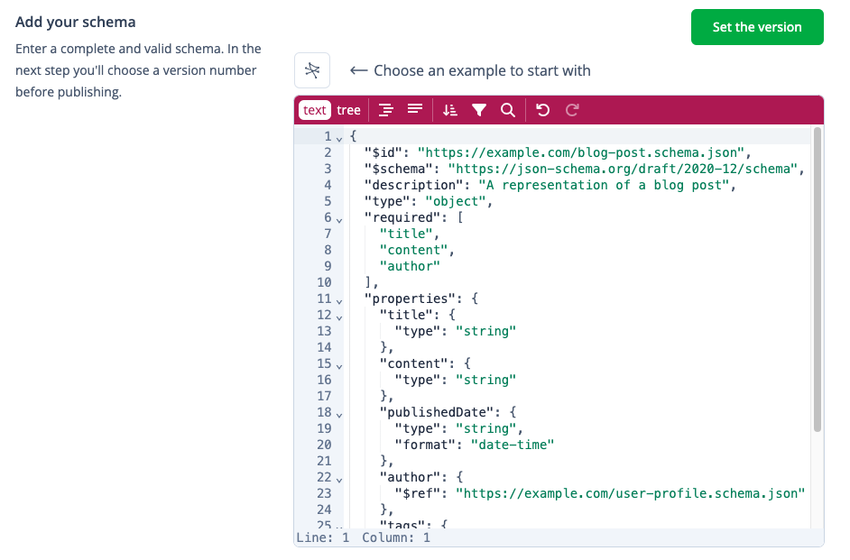
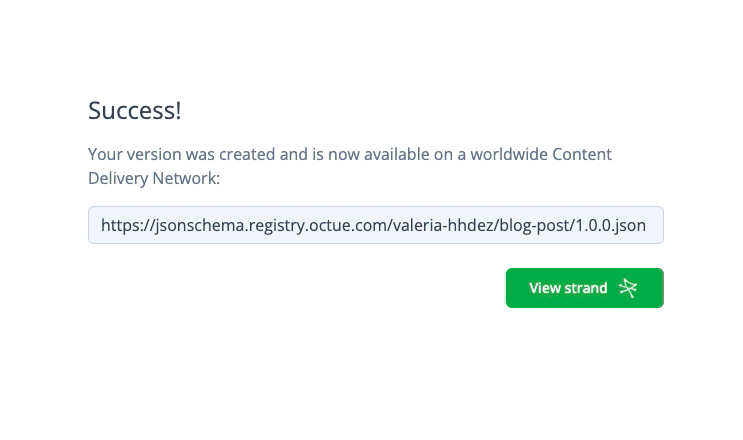

# Get started with Strands

## Introduction

Strands is an online app for creating, publishing, and managing JSON Schemas. It provides centralized schema management with the following functionalities: 

- Semantic version (SemVer) control.
- Global content distribution via a Content Delivery Network (CDN). 
- Robust user permissions to facilitate seamless collaboration and governance.

Read on to learn how to get started with Strands. 

## Prerequisites

- A modern web browser.
- Basic understanding of JSON Schema.
- Understanding of data validation concepts.

## Set up your account

1. Visit the [Strands website](https://strands.octue.com/account/signup) and sign up using your preferred email.
2. Complete the registration form.
3. Verify your email. 

## Create your first Strand

Before you begin, make sure you have:

- A well-defined schema structure.
- Version numbers for your schema (using the `major.minor.patch` format).
- Your user handle (which will be displayed next to your username). <!-- verify where the user handle can be located -->

1. Click your profile icon and select **Add new strand** from the menu. 
2. Name your strand removing any trailing spaces to avoid errors.
3. _Optional:_ Add labels to your strand. 
4. _Optional:_ Write a short description and a Readme.  
5. Click **Create Strand** to save your new Strand. 

**Tip:** The README of a JSON Schema helps users understand its broader context. Use this file to document information the technical schema definition alone doesn't convey, such as the schema's purpose, constraints, license, and sponsors. 

### Add a schema

Next, you'll need to enter a complete and valid JSON Schema. 

1. Select **Add a version**. 
2. Enter a complete and valid JSON Schema. You can:
   * Manually write your schema in the text editor.
   * Choose a template from our predefined examples.
3. Click **Set the version** to store your changes. 

**Note:** If your schema references other schemas, make sure they are already published on Strands or accessible via a URL.

### Add a version to your Strand

Strands utilizes Semantic Versioning (SemVer) to manage schema changes:

- **Major:** Incompatible changes. These changes will likely break existing integrations and require updates.
- **Minor:** Backward-compatible feature additions. It refers to new features that are added without affecting existing functionality.
- **Patch:** Backward-compatible bug fixes. Bug fixes are implemented without introducing new features or breaking existing functionality.

To version your Strand:

1. Assign a version number using the `major.minor.patch` format (e.g., `1.0.0`).
1. To finalize and publish your Strand, click **Save version**. 

🎉 Success! Your Strand is now live on the CDN.

   
## What’s next?

- Your schema is now accessible at the URL shown on the screen—use this URL to reference it in other schemas.
- You can now share your schema, integrate it into your applications, or create new versions as your data model evolves. 

🚀 You're all set! Start building with Strands today.

## Want to learn more? 

Dive into the following resources to continue growing your skills:

- JSON Schema best practices
- JSON Schema validation
- Core concepts